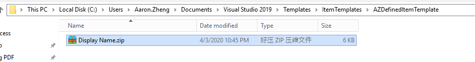
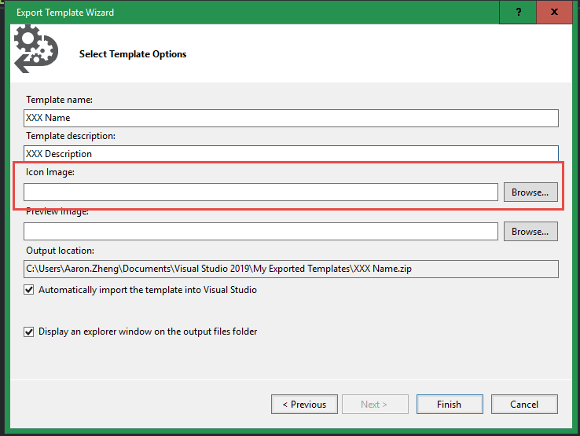

# Item Template

#### Create from existing

1. Apply to current VS
   1. Create:
   
      

      

      

      
      
      

      * Default Path: C:\Users\Aaron.Zheng\Documents\Visual Studio 2019\My Exported Templates
      * No need to un-zip the file, keep it as it is. (Unless you want to modify template, see below 3)

      Apply to current VS: put the zip file into the path:C:\Users\Aaron.Zheng\Documents\Visual Studio 2019\Templates\ItemTemplates

      

      * Restart current VS and try to add new Item into the project. The template with the name should be found

      

   2. Apply to different project types: 
      * By put the zip file into the different folder under path: C:\Users\Aaron.Zheng\Documents\Visual Studio 2019\Templates\ItemTemplates. Or even create your own folder under this path:

      

      

   3. Modified ICON, Display Name, Default Name:
      1. ICON:

      

      2. Display Name: (Unpacked zip file and modified .vstemplate. After done, zip .vstemplate back into .zip)
      3. Default Name: (Unpacked zip file and modified .vstemplate. After done, zip .vstemplate back into .zip)

      

2. Apply to VSIX (KEY)
   1. Added the .zip into VSIX asset in .vsixmanifest. The Item should be added into the project under folder 

      

      
   2. Build and start the project, a new instance of VS should start up. The new Item Template should show when trying to add a new item
   3. (Advanced)Show non-code format template in the General Level in VSIX, so it can be created without opening any project:

      * **KEY: Modified the ProjectType into General in .vstemplate, then zip it back**

      
      
      
            
      

#### Create from scratch

# Project Template

#### Create from existing

#### Create from scratch